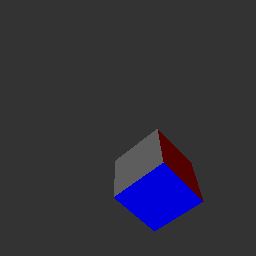

ezGfx
=====

Semi-private repo for a simple cross-platform graphics library project.
Detailed documentation is not yet available. 

  

TODO
====

## 3D ext

https://www.youtube.com/watch?v=nBzCS-Y0FcY&t=853s

* face normal information
* mesh files with material color

* transform/3D improvement : stop multipliing matrices for each triangle, pass the precalculated local "3D object" transform which is the same for each triangle of the mesh

* textri 
* textri with no perspective correction (PS1 look)
* 3D faces drawn on top of each other -> depth buffuring

* quaternion rotation on vec4f ?
* Other projection matrices

## Misc

* linux with no WM ==> kb inputs
                   ==> pb with stdout when running ? missing newline ?
                   ==> signals

* github/readme display gif
* Redo vectors again...
* scancode style keys
* Write documentation

## New Extensions

* GUI : windows, textboxes, buttons, sliders...
* splines calculation / bezier curves 2D/3D
* voxel engine

* lua / python / lisp / perl / js / bash / brainfuck / BNF defined / ocaml/ ??
	=> on the fly compiled scripting language ?
	https://github.com/lua/lua

## Platforms

* wasm support

## 2D ext

* dithering / demo
* "mode 7" demo

## Sound

* oscilloscope emulator demo
* windows sound
* no alsa
* on the fly file reading (no pcm array but "stream"... block by block)
* oscillo sound viewer
* midi / sequencer
* instruments
* score / midi editor
* FFT
* audio in

## Fonts

* UTF fonts
* TTF fonts

## Formats

* mesh files & materials
* midi
* vst
* png
* jpeg
* font ttf
* config files
* json files

