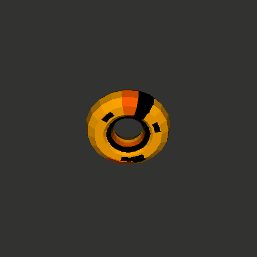

ezGfx
=====

Semi-private repo for a simple cross-platform graphics library project.
Detailed documentation is not yet available. 

TODO
====

## 3D ext

https://www.youtube.com/watch?v=nBzCS-Y0FcY&t=853s
https://www.youtube.com/watch?v=A-3T2OvULSc

* world transform / camera ?
* clipping
* material information and face normal ==> custom obj format ?
* Other projection matrices

## Inputs

* super/"windows" keys
* keystate : include mod key
* scancode style keys on windows
* linux with no WM ==> automatic device detection
* key typed on windows

## Misc 

* Redo vectors again...
* Write documentation
* wasm support

## New Extensions

* GUI : windows, textboxes, buttons, sliders...
* splines calculation / bezier curves 2D/3D
* voxel engine

* lua / python / lisp / perl / js / bash / brainfuck / BNF defined / ocaml/ ??
	=> on the fly compiled scripting language ?
	https://github.com/lua/lua

## 2D ext

* dithering / demo
* "mode 7" demo

## Fonts
* UTF fonts
* TTF fonts

## Formats
* png
* jpeg
* config files / json files

